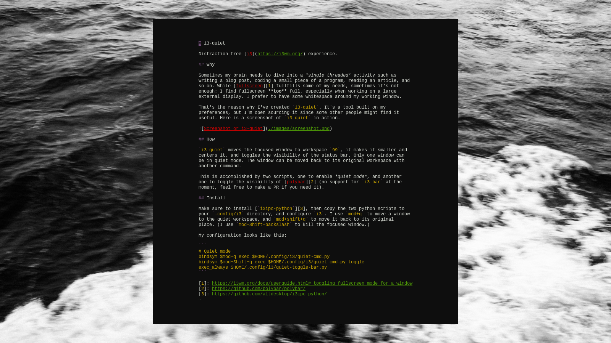

# i3-quiet

Distraction free [i3](https://i3wm.org/) experience.

## Why

Sometimes my brain needs to dive into a *single threaded* activity such as writing a blog post, coding a small piece of a program, reading an article, and so on. While [fullscreen][1] fullfills some of my needs, sometimes it's not enough: I find fullscreen **too** full, especially when working on a large external display. I prefer to have some whitespace around my working window.

That's the reason why I've created `i3-quiet`. It's a tool built on my preferences, but I'm open sourcing it since some other people might find it useful. Here is a screenshot of `i3-quiet` in action.



## How

`i3-quiet` moves the focused window to workspace `99`, it makes it smaller and centers it, and toggles the visibility of the status bar. Only one window can be in quiet mode. The window can be moved back to its original workspace with another command.

This is accomplished by two scripts, one to enable *quiet-mode*, and another one to toggle the visibility of [polybar][2] (no support for `i3-bar` at the moment, feel free to make a PR if you need it).

## Install

Make sure to install [`i3ipc-python`][3], then copy the two python scripts to your `.config/i3` directory, and configure `i3`. I use `mod+q` to switch to the quiet workspace, and `mod+shift+q` to start the `quiet mode`, see the configuration below:

```
# Quiet mode

mode "quiet" {
        # These bindings trigger as soon as you enter the resize mode

        # Move a window in and out the quiet mode
        bindsym q exec ~/.config/i3/quiet-cmd.py toggle ; mode "default"

        # Resize the window in quiet mode
        bindsym s exec ~/.config/i3/quiet-cmd.py resize small
        bindsym m exec ~/.config/i3/quiet-cmd.py resize medium
        bindsym l exec ~/.config/i3/quiet-cmd.py resize large

        # back to normal
        bindsym Escape mode "default"
        bindsym Return mode "default"
        bindsym Caps_Lock mode "default"
        bindsym $mod+d mode "default"
}

bindsym $mod+q exec $HOME/.config/i3/quiet-cmd.py switch
bindsym $mod+Shift+q mode "quiet"
exec_always $HOME/.config/i3/quiet-toggle-bar.py --kill
```

You can also play with the script from the CLI:

```
➜  i3-quiet git:(improve-cli) ✗ ./quiet-cmd.py -h
usage: quiet-cmd.py [-h] {toggle,switch,resize} ...

Control i3-quiet.

optional arguments:
  -h, --help            show this help message and exit

subcommands:
  valid subcommands

  {toggle,switch,resize}
                        additional help
```


[1]: https://i3wm.org/docs/userguide.html#_toggling_fullscreen_mode_for_a_window
[2]: https://github.com/polybar/polybar/
[3]: https://github.com/altdesktop/i3ipc-python/
